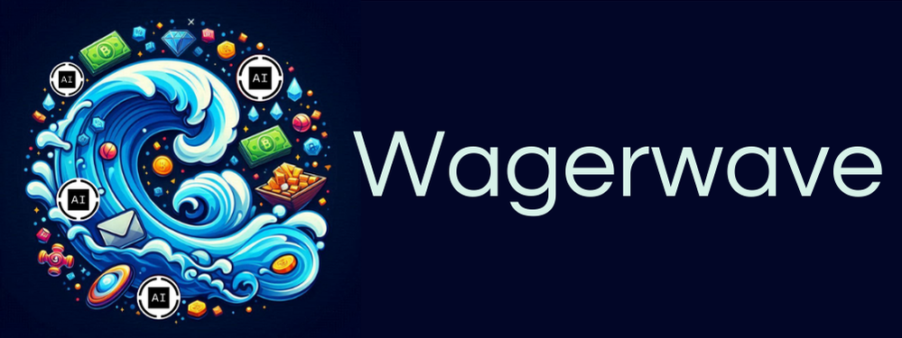
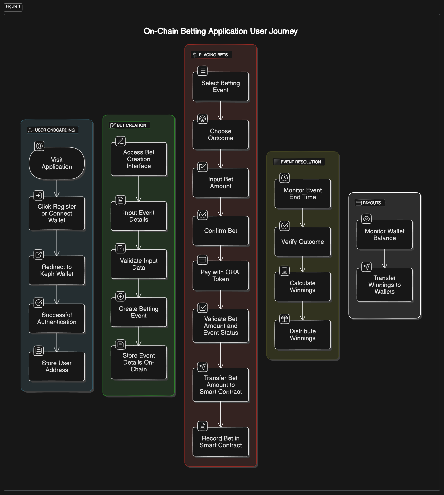

# **WagerWave** - On-Chain Betting Application

## Overview

**WagerWave** is a decentralized on-chain betting application designed for the oraichain. Utilizing CosmWasm smart contracts written in Rust and deployed on the Oraichain network, WagerWave ensures a secure, transparent, and decentralized platform for users to place bets on a variety of events.

## Project Description

The aim is to create an end-to-end application that contains the following components:

- **User onboarding**: Users register on the platform using their Keplr wallet.
- **Bet Creation**: Authorized entities can create betting events with specific parameters.
- **Placing Bets**: Users can place bets on their chosen outcome by sending tokens to the smart contract.
- **Event Resolution**: Once the event concludes, the outcome is verified, and the smart contract automatically distributes the winnings to the correct users.
- **Payouts**: Winnings are transferred directly to the users’ wallets.

## Technical Stack

- **Frontend**: React.js for building a responsive and user-friendly interface.
- **Backend**: Rust and CosmWasm for developing secure and efficient smart contracts.
- **Blockchain**: Oraichain for deploying and managing smart contracts.
- **Wallet Integration**: Keplr wallet for user authentication and transaction management.

## Proposed Architecture Diagram

## Project Phases and Time Estimates

### Phase 1: Planning and Research (1 week)

- Market Research: Understand the demand, competition, and legal aspects of on-chain betting.
- Requirement Analysis: Define project scope, objectives, and detailed specifications.

### Phase 2: Design (1 week)

- UI/UX Design: Create wireframes and mockups for the user interface.
- Smart Contract Design: Design the architecture and logic for smart contracts.

### Phase 3: Development (4 weeks)

- User and bet Management (2 week): Develop dapp for user registration, authentication using Keplr wallets and creating & managing betting events.
- Bet Placement, Event resolution and Payouts (2 week): Develop smart contract for placing bets, storing bet details, event resolution and automatic distribution of winnings.

### Phase 4: Testing (1 week)

- Unit Testing and Integration Testing:
  - Writing and executing unit tests for all smart contracts.
  - Test the integration between the frontend and smart contracts.

### Phase 5: Deployment (1 week)

- Smart Contract Deployment: Deploying the smart contracts to the Oraichain network and perform final checks and Launch the application to the public and monitor for issues.
